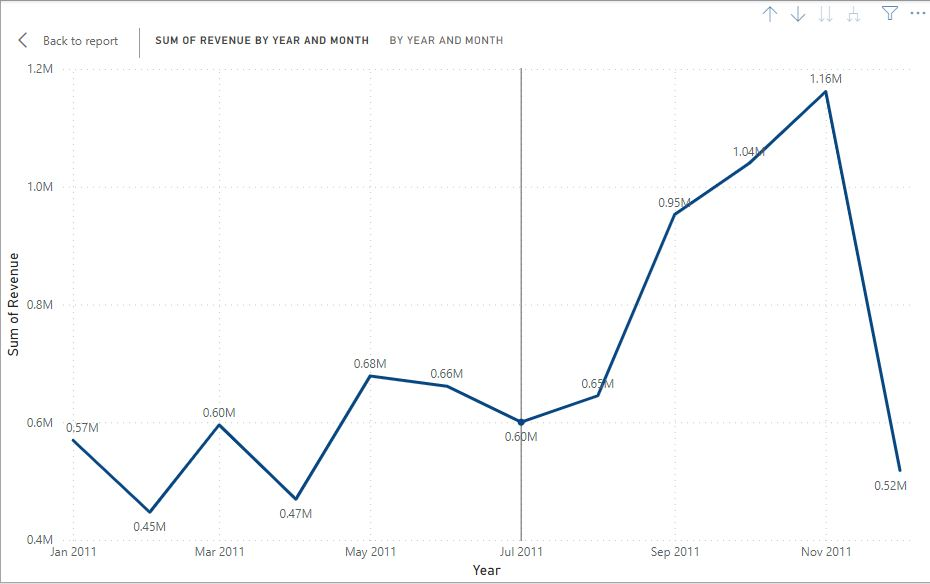
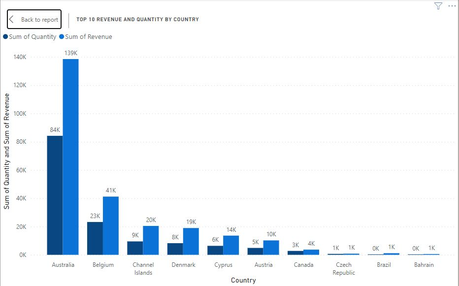
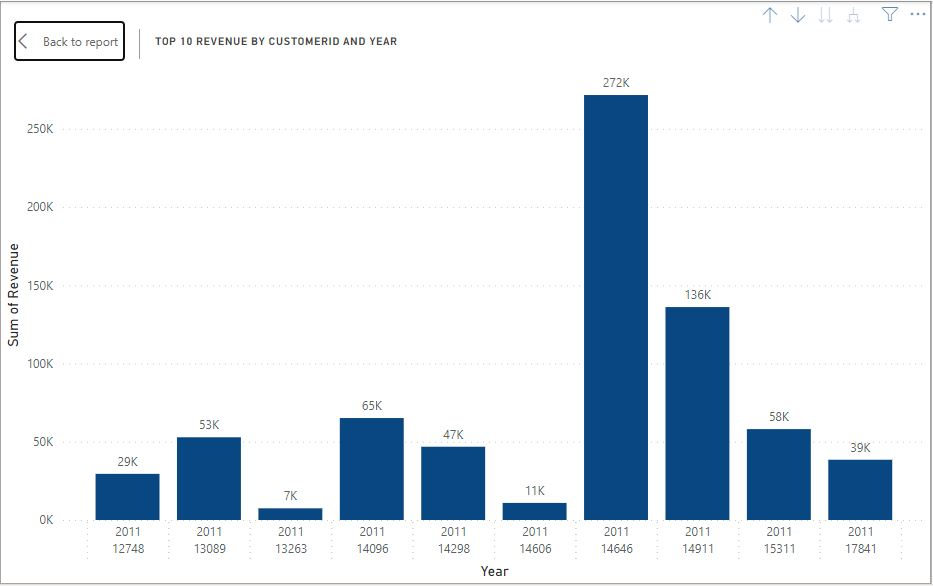
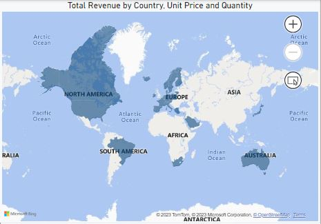
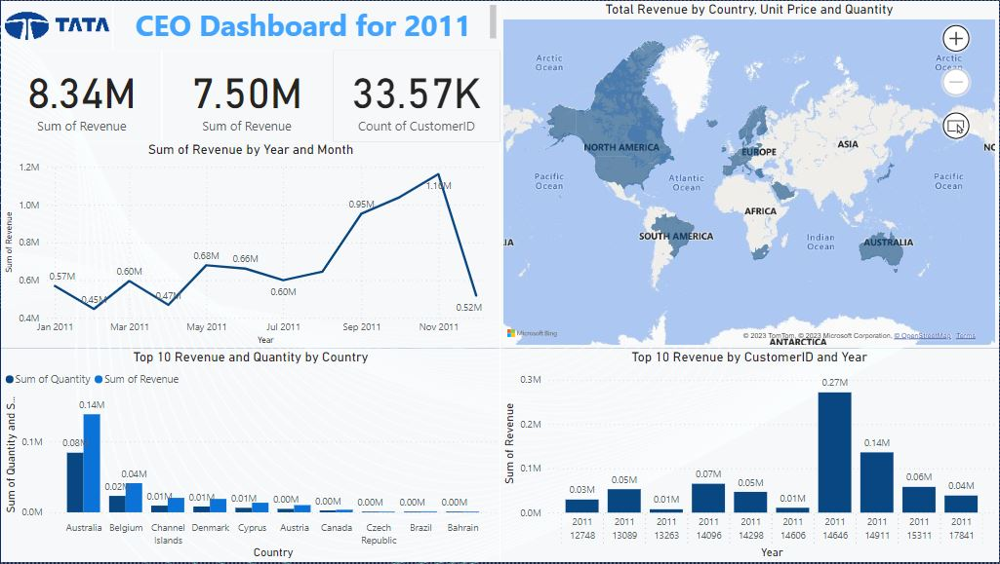

# TATA-CEO-Dashboard
Revenue Insights of the year 2011 around the world.

## Introduction 
I am pleased to introduce the TATA Retail Dashboard, a powerful tool designed to provide our CEO with comprehensive revenue insights from around the world. In response to our CEO's request for a dynamic and visually appealing representation of revenue data, this dashboard offers a matrix-based approach, presenting revenue trends by year, customer ID, and countries.

**_Disclaimer:_** _The data represented is only for learning purposes on real life requests for any Data Analyst and also should not be taken as direct insights_.

## Problem statement (CEO & CMO Request)
### Question 1
The CEO of the retail store is interested to view the time series of the revenue data for the year 2011 only. He would like to view granular data by looking into revenue for each month. The CEO is interested in viewing the seasonal trends and wants to dig deeper into why these trends occur. This analysis will be helpful for the CEO to forecast for the next year.

### Question 2
The CMO is interested in viewing the top 10 countries which are generating the highest revenue. Additionally, the CMO is also interested in viewing the quantity sold along with the revenue generated. The CMO does not want to have the United Kingdom in this visual.

### Question 3
The CMO of the online retail store wants to view the information on the top 10 customers by revenue. He is interested in a visual that shows the greatest revenue generating customer at the start and gradually declines to the lower revenue generating customers. The CMO wants to target the higher revenue generating customers and ensure that they remain satisfied with their products.

### Question 4
The CEO is looking to gain insights on the demand for their products. He wants to look at all countries and see which regions have the greatest demand for their products. Once the CEO gets an idea of the regions that have high demand, he will initiate an expansion strategy which will allow the company to target these areas and generate more business from these regions. He wants to view the entire data on a single view without the need to scroll or hover over the data points to identify the demand. There is no need to show data for the United Kingdom as the CEO is more interested in viewing the countries that have expansion opportunities.

## Skills/Concepts demonstrated
1. Excel data import to Power BI
2. Data cleansing using:
   - Power BI Query to transform data - Delete, Adjust and Add tables.
3. Matrix using DAX
   - to answer (CEO & CMO) questions or query like Revenue by year, country and customer.
4. Measures
5. Visualization

## Visualisation (Dashboard)

_You can interact with the report_ [here](https://app.powerbi.com/groups/me/reports/bd707ec5-4c56-43bf-9a35-8197c637db60/ReportSection?experience=power-bi)

## Conclusion 
In conclusion, the TATA Retail Dashboard represents a significant milestone in our journey towards data-driven excellence. With a focus on revenue insights from across the globe, this dashboard stands as a testament to our commitment to innovation and informed decision-making.

As we've seen today, the matrix-based representation of revenue by year, customer ID, and countries provides a holistic view of our business operations. It not only helps us identify trends and areas of growth but also allows us to address challenges with precision. By harnessing the power of this dashboard, our CEO and leadership team can make well-informed choices that align with our strategic goals and drive the continued success of TATA Retail.

As we move forward, we encourage all stakeholders to engage with the TATA Retail Dashboard, leveraging its capabilities to gain deeper insights into our global operations. This tool is not just a dashboard; it's a catalyst for positive change, fostering collaboration, data-driven decision-making, and ultimately, our company's growth.

We look forward to the opportunities this dashboard will unlock, the efficiencies it will create, and the strategic advantages it will provide. Together, we will navigate the dynamic landscape of global retail with confidence, secure in the knowledge that our decisions are guided by the power of data and insights.

Thank you for your attention, and let's embark on this exciting journey towards a more prosperous future for TATA Retail.
